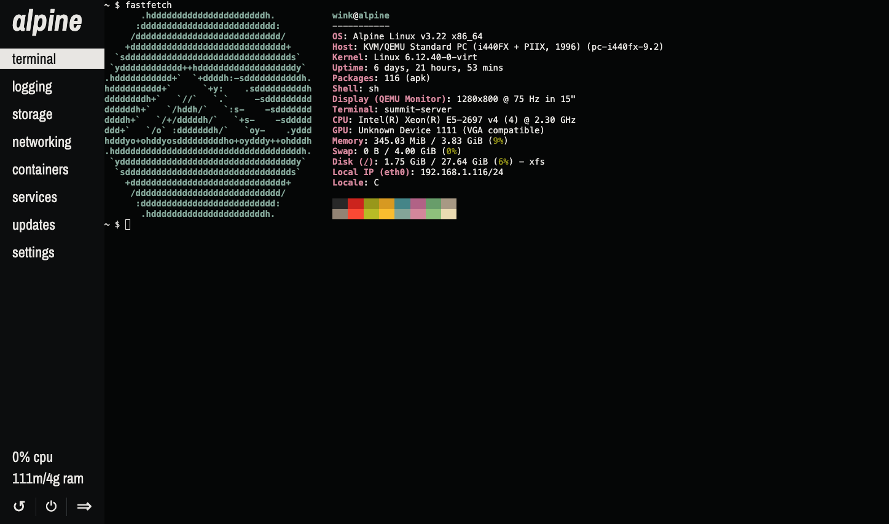

# summit


summit is a portable and self-contained Linux server management web dashboard that fits in 10MB.

> [!IMPORTANT]
> A lot of features (storage, networking, containers, updates, etc.) are missing currently.

## Features
- All of summit is distributed as one small file
- Portability across init systems and libcs (Tested with Debian and Alpine so far)
- Fast page loads
- PAM-based login system
- xterm.js-based terminal
- HTTP/2 & HTTPS

## Screenshots




## Building

All of these commands assume you're running as root. summit will likely build & run on other systems, but I have not tested.

The final compiled output is simply `./summit`. By default, summit installs to `/usr/local/bin`. 

### Alpine

> [!NOTE]
> Make sure you have the community repo enabled

```sh
apk add go make linux-pam-dev git openssl minify \
    && git clone https://github.com/winksplorer/summit \
    && cd summit \
    && make all install
```

### Debian

```sh
apt install golang-go make libpam0g-dev git openssl minify \
    && git clone https://github.com/winksplorer/summit \
    && cd summit \
    && make all install
```

## Code structure

### *.go

The backend server code. It serves the frontend, and provides a simple API using [WebSockets + MessagePack](doc/COMMUNICATION.md). Written in Go.

### frontend

The frontend web UI code. Written in HTML, vanilla CSS, and vanilla JS.

## TODO

- [X] HTTP/2
- [X] TLS
- [X] Login
    - [X] PAM
    - [X] Login page
    - [X] Cookies
    - [X] Admin system
- [X] Stats
    - [X] Basic numerical stats
    - [X] Implement Odometer
    - [X] Make stat values persist across pages
- [X] WebSocket terminal
    - [X] Switch to xterm.js
    - [X] Firefox compatibility
    - [X] Fix doas
- [X] UI Notifications
- [X] Implement templates
- [X] WebSocket + MessagePack API
- [X] Settings
    - [X] Settings page
    - [X] Backend settings system
    - [X] Frontend settings system
    - [X] Default config
- [X] Complete frontend redesign
    - [X] Independent pages
        - [X] Login prototype
        - [X] Responsiveness
        - [X] Admin page
        - [X] Cleanup
    - [X] Main UI
        - [X] Colors
        - [X] Sidebar
        - [X] Main page content
    - [X] Messages
    - [X] Input elements
    - [X] Light mode
    - [X] Sync with system dark/light theme
- [X] Global config
- [X] 404 page
- [X] Go embedding
- [ ] Extend session + connection length on activity
- [ ] Storage
    - [ ] Backend
        - [X] ID/name
        - [X] Readonly
        - [X] Size
        - [X] Model/serial
        - [X] Partitions
        - [X] FS type
        - [X] Mountpoint
        - [X] Basic SMART data (Temperature, power cycles, power on hours, etc.)
        - [ ] Advanced SMART data (Reallocated_Sector_Ct, Percent_Lifetime_Remain, etc.)
    - [ ] Storage page
    - [ ] Handle unpartitioned disks
- [ ] Networking
    - [ ] Backend
    - [ ] Networking page
- [ ] Services
    - [ ] Backend
        - [ ] OpenRC support
        - [ ] systemd support
        - [ ] other init systems
    - [ ] Services page
- [ ] Updates
    - [ ] Backend
        - [ ] apt support
        - [ ] apk support
        - [ ] other package managers
    - [ ] Updates page
- [ ] Service files
- [ ] Installer shell script
- [ ] Containers
    - [ ] Backend
        - [ ] Podman support
        - [ ] Docker support
    - [ ] Container page
- [ ] Logging
    - [ ] Backend
        - [ ] Application-specific logs?
        - [ ] Init system logs
        - [ ] Kernel logs
    - [ ] Logging page