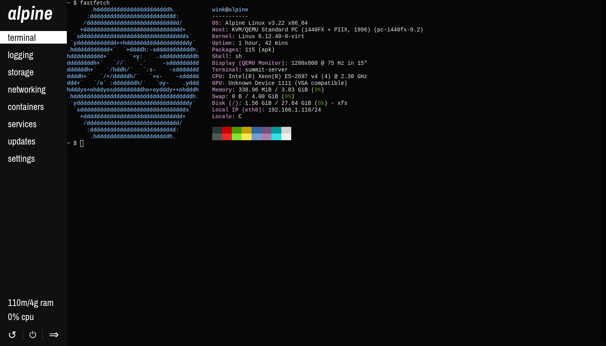

# summit


summit is a portable and self-contained server management web dashboard for Linux and BSD that fits in 3MB.

> [!NOTE]
> Currently, many features (storage, networking, containers, updates, etc.) are missing. However, summit is under rapid development and I expect it to be "finished" before October. (Not a hard promise, though!)

## Features
- All of summit is distributed as one file
- As of July 29th, 2025, the entire final executable is ~3.0 MB
- Portability (Tested with Debian, Alpine, and FreeBSD so far)
- Fast page loads
- PAM-based login system
- xterm.js-based terminal
- HTTP/2 & HTTPS

## Screenshot



## Building

All of these commands assume you're running as root. summit will likely build & run on other systems, but I have not tested.

The final compiled output is simply `./summit`. By default, summit installs to `/usr/local/bin`. 

### Alpine

> [!NOTE]
> Make sure you have the community repo enabled

```sh
apk add go make clang binutils libarchive-dev linux-pam-dev git openssl minify xz \
    && git clone https://github.com/winksplorer/summit \
    && cd summit \
    && make all install
```

### Debian

```sh
apt install golang-go make clang binutils libarchive-dev libpam0g-dev git openssl minify \
    && git clone https://github.com/winksplorer/summit \
    && cd summit \
    && make all install
```

### FreeBSD

```sh
pkg install go gmake binutils libarchive git openssl minify gsed \
    && git clone https://github.com/winksplorer/summit \
    && cd summit \
    && gmake all install LD=ld.gold SED=gsed \
    && mkdir -p /etc/ssl/private
```

## Code structure

### backend

The backend server code. It serves the frontend, and provides a simple API using [WebSockets + MessagePack](doc/COMMUNICATION.md). Written in Go.

### frontend

The frontend web UI code. Written in HTML, vanilla CSS, and vanilla JS.

### sea.c

The self-extracting archive code so that the entire server is distributed as one file. Written in C.

## TODO

- [X] SEA
- [X] HTTP/2
- [X] TLS
- [X] Login
    - [X] PAM
    - [X] Login page
    - [X] Cookies
    - [X] Admin system
    - [X] Slight refactoring (use my other login impl instead)
- [X] Stats
    - [X] Basic numerical stats
    - [X] Implement Odometer
    - [X] Make stat values persist across pages
- [X] WebSocket terminal
    - [X] Switch to xterm.js
    - [X] Firefox compatibility
    - [X] Fix the fucking thing
    - [X] Fix doas
- [X] UI Notifications
- [X] Implement templates
- [X] Use a WebSocket connection instead of HTTP endpoints
    - [X] Proof of concept (Stats test)
    - [X] Fully switch to WebSockets
- [X] Simplify entire frontend
    - [X] Simplify HTML using templates
    - [X] Simplify JS
        - [X] Use `window._`
        - [X] Bundling
        - [X] Minification
    - [X] Simplify CSS
- [X] Settings
    - [X] Settings page
    - [X] Backend settings system
    - [X] Frontend settings system
    - [X] Default config
- [ ] Complete frontend redesign
    - [X] Independent pages
        - [X] Login prototype
        - [X] Responsiveness
        - [X] Admin page
        - [X] Cleanup
    - [X] Main UI
        - [X] Colors
        - [X] Sidebar
        - [X] Main page content
    - [X] Messages
    - [X] Input elements
    - [X] Light mode
    - [X] User choosable accent color
    - [X] Sync with system dark/light theme
- [ ] Global config
- [ ] Mac-style padlock system
- [ ] Logging
    - [ ] Backend
        - [ ] Application-specific logs?
        - [ ] Init system logs
        - [ ] Kernel logs
    - [ ] Logging page
- [ ] Storage page
- [ ] Networking page
- [ ] Containers
    - [ ] Backend
        - [ ] Podman support
        - [ ] Docker support
    - [ ] Container page
- [ ] Services
    - [ ] Backend
        - [ ] OpenRC support
        - [ ] systemd support
        - [ ] other init systems
    - [ ] Services page
- [ ] Updates
    - [ ] Backend
        - [ ] apt support
        - [ ] apk support
        - [ ] pkg support
        - [ ] other package managers
    - [ ] Updates page
- [ ] Service files
- [ ] Installer shell script